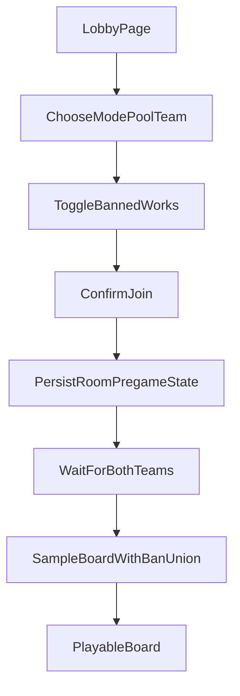

# Ban-Pick Room Flow

## Status
Design and implementation reference for the online room pregame flow.

## Summary
Online rooms now have a pregame phase before the bingo board exists.

- Each side may ban up to `max_banned_works_per_player` works.
- Works are identified by `SeriesID`.
- Red and blue bans are merged by union.
- The board is sampled only after both red and blue have confirmed.
- The first confirmed player waits on a holding screen until the other side arrives.

## Goals
- Let each side toggle banned works with a simple click-to-select, click-to-unselect interaction.
- Keep the ban cap configurable on the server.
- Prevent the room from becoming playable until both teams are present.
- Preserve room persistence across restarts.
- Keep observers read-only and outside the ban flow.

## Room Lifecycle

## Server State
`state.py` extends `BingoRoomState` with pregame room metadata:

- `player_bans`: confirmed banned `SeriesID`s for red and blue.
- `joined_teams`: whether red and blue have confirmed into the room.
- `spellcard_id_map`: left empty until the room becomes ready.
- `banned_series_union`: derived from the union of both players' confirmed bans.

Legacy saved rooms that already have a sampled board are treated as ready when loaded, so previously created rooms remain playable.

## Join And Waiting Behavior
`POST /api/lobby/join` is now the confirm action instead of an immediate play action.

- Red and blue submit `{ room, team, mode, pool, banned_series }`.
- Observer submits `{ room, team, mode, pool, banned_series: [] }`.
- The server validates:
  - room settings compatibility,
  - ban count against `max_banned_works_per_player`,
  - banned works exist in the selected pool,
  - enough spellcards remain after applying the merged bans.
- If validation succeeds, the room stores the side's confirmed bans and ready flag.
- If only one team is present, the room stays in `waiting`.
- Once both teams are confirmed, the board is sampled exactly once and the room moves to `ready`.

Clients poll room state through `/state` and also listen for `state_updated` over SSE. This lets the first player automatically transition from the waiting screen into the board without reloading.

## Ban Rule
The effective room ban list is:

`union(red.player_bans, blue.player_bans)`

This means any work selected by either side is removed from the candidate pool.

## Sampling Rules
Room sampling filters the selected pool DataFrame by `SeriesID` before random choice.

- Eligible rows are all spellcards whose `SeriesID` is not in the merged ban set.
- Sampling uses room-local DataFrame labels, so saved room board references remain stable.
- If fewer than `size * size` eligible spellcards remain, the join request is rejected.
- Privileged spellcards are only injected if they still belong to an eligible work. A privileged card from a banned work is skipped.

## Frontend Flow
### Lobby
`static/lobby.html` now shows:

- room ID,
- mode,
- pool,
- side selection,
- a work chip list for the chosen pool,
- a join button that confirms bans and enters the room.

Interaction rules:

- Click a work chip to select it.
- Click the same chip again to remove it.
- Once the player reaches the configured cap, further unselected chips are disabled.
- Observer mode disables the ban chip list.

### Room Page
`static/index.html` now supports two phases:

- `waiting`: full-page overlay with joined status for red and blue plus the confirmed bans.
- `ready`: normal board interaction.

Observers can enter the room early, but only see the playable board after the room becomes ready.

## Failure Cases
- Incompatible room settings: join is rejected and the client is told to use a new room ID.
- Too many banned works: join is rejected with a validation error.
- Unknown `SeriesID`: join is rejected.
- Too few spellcards left after bans: join is rejected and the player must loosen bans.
- Pregame room actions on `/click`, `/hp`, or `/reset`: rejected until both teams have confirmed.

## Persistence Notes
- Pregame room state is stored in `data/rooms/{room_id}/state.json`.
- A room can now persist in an unsampled waiting state.
- After both teams confirm, the sampled board is also persisted in the same file.
- Existing rooms with a stored board are treated as already ready for compatibility.

## Config
`defs.py` exposes:

- `max_banned_works_per_player = 2`

The frontend reads this value from `/api/config` and `/state` rather than hardcoding the limit.
