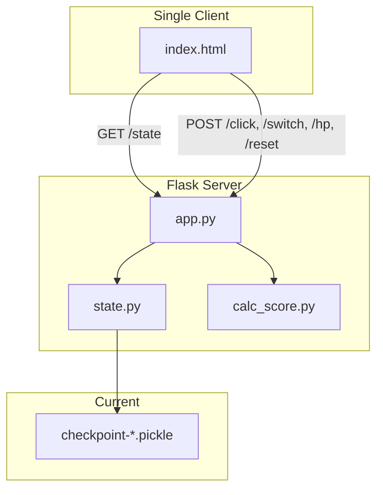

# Spellcard Bingo Online Adaptation — Design Document

**Document status:** Design (implemented)  
**Version:** 1.0  
**Related branch:** `online-dev`

---

## 1. Executive Summary

This document describes the design for adapting the local Spellcard Bingo game into an online, multi-user version. The adaptation introduces room-based play, team selection (BLUE/RED), support for multiple connections per team (for reconnects), and persistent state storage. The design draws on patterns from the `local_reference` project (Geography Guesser) for lobby flow, room-scoped API, and Server-Sent Events (SSE), while adapting Spellcard Bingo’s state model and adding file-based persistence.

---

## 2. Goals and Constraints

- **Online play:** Two users (or parties) play over the internet, each representing a team (BLUE or RED).
- **Room mechanism:** Players enter a room ID and select a team (BLUE/RED). There is no automatic matching logic—players join directly.
- **Reconnect support:** Multiple connections per team are allowed (e.g., stale tabs/devices may reconnect).
- **State persistence:** Room state persists across server restarts, unlike the reference project’s ephemeral rooms.
- **Trust-based:** No anti-cheat; players are trusted to follow rules. The project provides only the game UI; Touhou gameplay is external.

---

## 3. Current Architecture (Local Spellcard Bingo)



- **State:** Global in `state.py` — `team_cell_state_dict`, `team_hp_dict`, `spellcard_id_map`, `sys_team`, `sys_op`.
- **Persistence:** Pickle files in `data/checkpoint-{id}.pickle` (board layout, cell states, HP).
- **Client model:** A single operator selects RED or BLUE via a “select” control and acts for that team.

---

## 4. Target Architecture (Online)

```mermaid
flowchart TB
    subgraph Clients [Clients]
        lobby[lobby.html]
        game1[Game Client RED]
        game2[Game Client BLUE]
    end
    subgraph Server [Flask Server]
        app_online[app.py]
        state_module[state.py]
    end
    subgraph Storage [Persistence]
        room_files[data/rooms/room_id/]
    end
    subgraph Realtime [SSE]
        events[/events/room_id]
    end
    lobby -->|Join room + team| app_online
    lobby --> game1
    lobby --> game2
    game1 -->|room + team| app_online
    game2 -->|room + team| app_online
    app_online --> state_module
    state_module --> room_files
    app_online --> broadcast[event_queues]
    broadcast --> events
    game1 --> events
    game2 --> events
```

---

## 5. Reference: local_reference Patterns

Patterns reused from the `local_reference` project:

| Component         | local_reference                                                       | Spellcard Bingo Adaptation                                  |
| ----------------- | --------------------------------------------------------------------- | ---------------------------------------------------------- |
| **Lobby**         | Room input, quick match or room match                                 | Simpler: room ID + team (BLUE/RED) choice; no matching    |
| **Entry flow**    | `/api/lobby/quick_match` → poll → redirect to `?room=X&team=Y`        | `/api/lobby/join` with `{room, team}` → immediate redirect |
| **Room-scoped API** | All endpoints use `?room=` and `?team=`                            | Same pattern for `/state`, `/click`, `/hp`, etc.           |
| **SSE broadcast** | `event_queues[room_id]`, `broadcast()`, `/events/<room_id>`          | Same: broadcast on click, hp, reset                        |
| **Per-room state**| `RoomState`, `rooms: Dict[str, RoomState]`                            | `BingoRoomState` with spellcard grid + cell states + HP    |
| **Team in request**| Actions include `team` (query or body)                                | Actions include `team`; no global `sys_team`              |

**Key difference:** local_reference uses matching (pair blue + red). Spellcard Bingo uses direct join—the user chooses room ID and team, and multiple same-team connections are allowed.

---

## 6. Lobby Design

### 6.1 Lobby Page (`static/lobby.html`)

- **Room ID:** Text input (user-defined, e.g. `abc123`).
- **Team:** Choose BLUE or RED (buttons).
- **Play:** Submit → `POST /api/lobby/join` with body `{ room: string, team: "red"|"blue" }`.

### 6.2 Join Flow

No matching. Join flow:

1. User submits room ID and team.
2. Client sends `POST /api/lobby/join` with `{ room, team }`.
3. Server ensures the room exists (creates it if first joiner).
4. Server responds with `{ ok: true, room, team }`.
5. Client redirects to `/?room={room}&team={team}`.

- **Multiple same-team:** Allowed. For example, two BLUE tabs can both operate BLUE; last write wins. This supports reconnects.

---

## 7. Room State Model

Per-room state lives at the end of `state.py`, separated by comments from the local/single-session state above.

### 7.1 Per-Room State (`BingoRoomState`)

Per-room state replaces the global state for online mode:

```python
class BingoRoomState:
    spellcard_id_map: Dict[Coord, int]      # (r,c) -> spellcard index
    team_cell_state_dict: Dict[Team, CellStateDict]
    team_hp_dict: Dict[Team, Dict[Coord, int]]
    spellcard_score_map: Dict[Coord, int]   # derived from spellcard_id_map
    seed: int  # for reproducible board sampling (derived from room_id)
    lock: threading.Lock
```

There is no global `sys_team` or `sys_op`; each client is tied to one team from the lobby.

### 7.2 Persistence Strategy

- **Path:** `data/rooms/{room_id}/state.json`
- **Save:** After each mutation (click, hp, reset).
- **Load:** On first access to a room via `get_room(room_id)`; if a file exists, load; otherwise initialize and sample a board.
- **Format:** JSON. Coord keys serialized as `"r,c"` for JSON compatibility.

---

## 8. API Design

### 8.1 Scoping

All game endpoints require `?room=` and `?team=` (team identifies the acting client). The request’s `team` indicates whose actions are performed.

### 8.2 Endpoints

| Endpoint              | Method | Query       | Body              | Behavior                                                  |
| --------------------- | ------ | ----------- | ----------------- | --------------------------------------------------------- |
| `/`                   | GET    | `room`, `team` | —               | Serve game if both present; else redirect to `/lobby`     |
| `/lobby`              | GET    | —           | —                 | Serve lobby page                                          |
| `/api/lobby/join`     | POST   | —           | `{ room, team }`  | Create/join room, return `{ ok, room, team }`             |
| `/state`              | GET    | `room`, `team` | —               | Full state payload (room-scoped)                           |
| `/click`              | POST   | `room`, `team` | `{ r, c }`      | Apply click for `team`; broadcast `state_updated`         |
| `/hp`                 | POST   | `room`, `team` | `{ team, delta }`| Adjust HP for team’s pending cell; broadcast               |
| `/reset`              | POST   | `room`      | —                 | Reset room state (if allowed); broadcast                   |
| `/events/<room_id>`   | GET    | —           | —                 | SSE stream for room                                       |

- **Switch:** Removed in online mode. Each client is fixed to one team from the lobby.
- **Reset:** Subject to `show_reset_button` (from `defs.py`). Same rule as local mode.

### 8.3 Broadcast Triggers

After any mutating action (`click`, `hp`, `reset`): `broadcast(room_id, "state_updated")`. Clients subscribed to `/events/<room_id>` refetch `/state` on receipt.

---

## 9. Frontend Changes

### 9.1 Entry

- Root `/`: If `room` or `team` is missing, redirect to `/lobby`.
- Lobby: Form → join → redirect to `/?room=X&team=Y`.

### 9.2 Game Page (`static/index.html`)

- **URL:** `/?room=X&team=Y`.
- **Team:** Fixed from URL. “Select” controls show “you” for the client’s team and are disabled.
- **API calls:** Append `?room=...&team=...` to all game requests.
- **SSE:** On load, open `EventSource(/events/{room_id})`; on `state_updated`, call `fetchState()`.
- **HP/Click:** Include `team` in body or query; server uses it for authorization.

### 9.3 UI Simplification

- Single-team view: Each client sees controls only for its team. Both see the full board state.
- HP controls for the other team are disabled (display-only).

---

## 10. File Layout

```
SpellcardBingo/
├── app.py              # Lobby routes, room-scoped routes, SSE
├── state.py            # Spellcard data loading; BingoRoomState, get_room, save_room (online) at end
├── calc_score.py       # Scoring logic; room-aware variants
├── defs.py             # Constants (unchanged)
├── static/
│   ├── lobby.html      # Room + team entry
│   └── index.html      # Game UI with room/team params, SSE, team-scoped UI
├── data/
│   ├── SpellcardData.csv
│   └── rooms/
│       └── {room_id}/
│           └── state.json   # Per-room persistence
└── docs/
    └── online-adaptation.md   # This document
```

---

## 11. State Serialization Schema

JSON structure for `data/rooms/{room_id}/state.json`:

```json
{
  "spellcard_id_map": { "0,0": 42, "0,1": 17, ... },
  "team_cell_state_dict": {
    "red": { "0,0": "unchecked", "0,1": "pending", ... },
    "blue": { ... }
  },
  "team_hp_dict": {
    "red": { "0,0": 5, "0,1": 3, ... },
    "blue": { ... }
  }
}
```

Coord keys use the `"r,c"` format for JSON compatibility.

---

## 12. Concurrency

- **Per-room lock:** `threading.Lock` per room for mutations.
- **Persistence:** Write under the same lock; keep critical sections short.
- **SSE:** Non-blocking `queue.Queue.put`; broadcast does not require additional locking.

---

## 13. Open Decisions

- **Reset:** Who can reset? (Any player vs. host only.)
- **Spectator:** Allow `?room=X` without team for view-only access? (Lower priority.)
- **Room cleanup:** TTL or manual cleanup for idle rooms to avoid unbounded growth.
